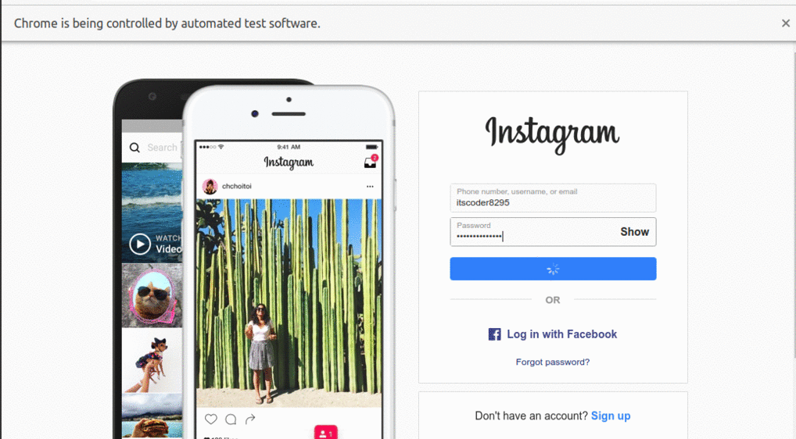

# Instagram Direct message bot 

This is a kind of Instagram bot that will send the direct message to the users using selenium as a python package. It can be useful for the influencers, organization, etc. <br>
copy the code or clone the repository to make your own personal instagarm direct message bot or if you want me to design any kind of bot, I'll be happy for doing this at just $2

## Technologies I used

- python (selenium package)
- chromedriver 87 version

## Installation of InstagramDm_bot- To Your Machine.

Clone this repo to your machine. If you need help with this part, GitHub has [great documentation](https://help.github.com/articles/fork-a-repo/)

## This is how the extension looks:



I have done this whole Project in Visual Studio code. if you don't have Visual Studio code setup in ur computer ,download it by [clicking here](https://code.visualstudio.com/Download)

## About the author

[LinkedIn - Nikhil Mahajan](https://www.linkedin.com/in/nikhil-mahajan-92b9631a0/ "Nikhil Mahajan's LinkedIn profile")\

[Web - Nikhil Mahaan](https://nikhilmahajan.netlify.app/ "Nikhil Mahajan Portfolio")

```

```
